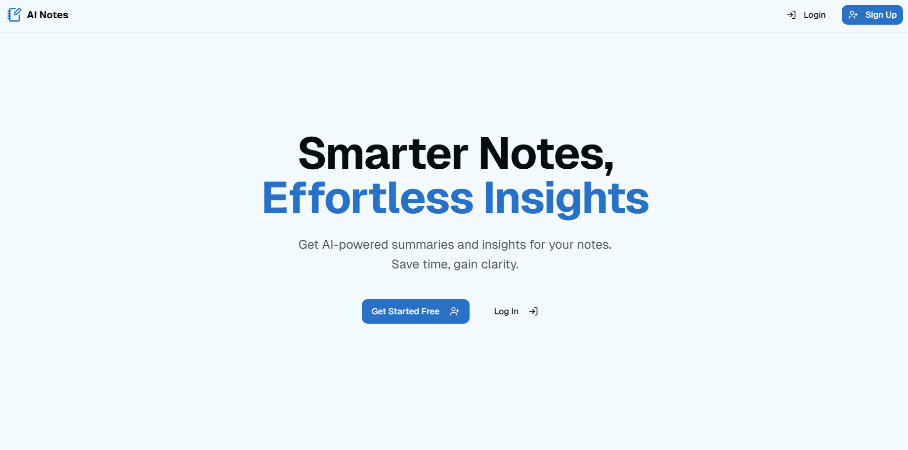

# AI Notes 📝✨

A modern note-taking application built with Next.js, Supabase, and Tailwind CSS, featuring AI-powered summarization using the Vercel AI SDK and Google Gemini. Organize your thoughts, generate summaries, and manage notes effortlessly.

[](https://ai-note-ten.vercel.app/)

**Live Demo:** [https://ai-note-ten.vercel.app/](https://ai-note-ten.vercel.app/)

**Repository:** [https://github.com/naman-makkar/ai-note](https://github.com/naman-makkar/ai-note)

## 📸 Screenshot

  
_<!-- TODO: Replace this with an actual screenshot of your application dashboard! -->_

## ✨ Features

This project fulfills the requirements of the assignment by implementing the following features:

*   **🔑 User Authentication:** Secure sign-up and login using:
    *   Google OAuth
    *   Email & Password
*   **📝 Full CRUD Operations:** Create, Read, Update, and Delete notes seamlessly.
*   **🤖 AI Summarization & Enhancement:**
    *   Integration with Google Gemini via the Vercel AI SDK (`@ai-sdk/google`).
    *   Generates structured summaries including priority tasks and productivity tips.
*   **🔄 State Management:** Efficient data fetching, caching, and state synchronization using TanStack Query (React Query).
*   **🎨 Modern UI Components:** Built with the sleek and customizable [Shadcn UI](https://ui.shadcn.com/) component library.
*   **📱 Responsive Design:** Adapts fluidly to various screen sizes using Tailwind CSS.
*   **🛠️ Robust Form Handling:** Utilizes `react-hook-form` for form state management and `zod` for validation.
*   **🔔 Notifications:** User feedback provided via `sonner` toasts.

## 🚀 Tech Stack

*   **Framework:** [Next.js](https://nextjs.org/) (v14 with App Router)
*   **Language:** [TypeScript](https://www.typescriptlang.org/)
*   **Backend & Auth:** [Supabase](https://supabase.io/)
*   **Styling:** [Tailwind CSS](https://tailwindcss.com/)
*   **UI Components:** [Shadcn UI](https://ui.shadcn.com/)
*   **State Management:** [TanStack Query (React Query)](https://tanstack.com/query/latest)
*   **AI Integration:** [Vercel AI SDK](https://sdk.vercel.ai/) / [@ai-sdk/google](https://sdk.vercel.ai/docs/guides/providers/google-generative-ai) (with Google Gemini)
*   **Form Handling:** [React Hook Form](https://react-hook-form.com/)
*   **Schema Validation:** [Zod](https://zod.dev/)
*   **Notifications:** [Sonner](https://sonner.emilkowal.ski/)
*   **Icons:** [Lucide React](https://lucide.dev/)

## 🔧 Getting Started

Follow these steps to set up and run the project locally.

### Prerequisites

*   Node.js (v18 or later recommended)
*   npm, pnpm, or yarn
*   A Supabase account ([supabase.com](https://supabase.com/))
*   A Google AI API Key ([makersuite.google.com/app/apikey](https://makersuite.google.com/app/apikey))

### Installation

1.  **Clone the repository:**
    ```bash
    git clone https://github.com/naman-makkar/ai-note.git
    cd ai-note
    ```
2.  **Install dependencies:**
    ```bash
    npm install
    # or
    # pnpm install
    # or
    # yarn install
    ```

### Environment Setup

1.  **Create Supabase Project:** Set up a new project on Supabase.
2.  **Enable Authentication Providers:**
    *   Enable **Email/Password** authentication in your Supabase project settings (Authentication -> Providers).
    *   Enable **Google** authentication. Follow the Supabase guide to get your Google Cloud credentials (Client ID, Client Secret) and add them to the Supabase Google provider settings.
    *   **Crucially:** Ensure the **Authorized redirect URI** in your Google Cloud Console OAuth client settings exactly matches the one provided in your Supabase Auth settings (e.g., `http://localhost:3000/auth/callback` for local development). Add URIs for deployment as well.
3.  **Database Setup:** No specific table setup is required initially; Supabase handles user tables. The application code will likely interact with a `notes` table (ensure RLS policies are set up appropriately for security if you create it).
4.  **Get Supabase Credentials:** Find your Project URL and `anon` key in your Supabase project settings (Project Settings -> API).
5.  **Get Google AI API Key:** Generate an API key from Google AI Studio.
6.  **Create `.env.local` file:** Create a file named `.env.local` in the root of the project and add your credentials:
    ```env
    NEXT_PUBLIC_SUPABASE_URL=YOUR_SUPABASE_PROJECT_URL
    NEXT_PUBLIC_SUPABASE_ANON_KEY=YOUR_SUPABASE_ANON_KEY
    GOOGLE_API_KEY=YOUR_GOOGLE_AI_API_KEY 
    ```
    *Replace placeholders with your actual keys.*

### Running Locally

1.  Start the development server:
    ```bash
    npm run dev
    ```
2.  Open [http://localhost:3000](http://localhost:3000) in your browser.

## ☁️ Deployment

This application is optimized for deployment on [Vercel](https://vercel.com/).

1.  Push your code to a Git repository (GitHub, GitLab, Bitbucket).
2.  Import the project into Vercel.
3.  Configure the Environment Variables in the Vercel project settings (same as your `.env.local` file):
    *   `NEXT_PUBLIC_SUPABASE_URL`
    *   `NEXT_PUBLIC_SUPABASE_ANON_KEY`
    *   `GOOGLE_API_KEY`
4.  Deploy! Vercel will automatically build and deploy your Next.js application.
5.  Remember to add your Vercel deployment URL (e.g., `https://YOUR_APP_NAME.vercel.app/auth/callback`) to the list of **Authorized redirect URIs** in both your Supabase Auth settings and your Google Cloud Console OAuth settings.

**Live Site:** [https://ai-note-ten.vercel.app/](https://ai-note-ten.vercel.app/)

## 📄 License

This project is licensed under the MIT License.
